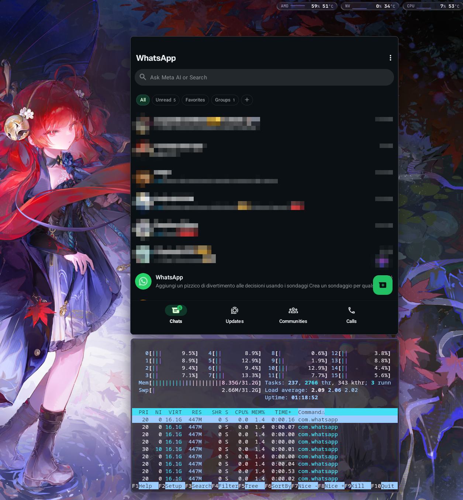

# Droidloom

Droidloom runs Android apps in separate Linux Wayland windows. It uses a shared
kernel Android userspace with real Android APIs, GPU acceleration and a native
desktop application catalog.

<p align="center">
  
</p>

This is an early preview. The package workflow targets x86_64 Arch Linux and
Omarchy with AMD or Intel graphics. WhatsApp and Phone have been tested on Omarchy
with Hyprland, including tiled resizing on an AMD/NVIDIA laptop using its AMD GPU.
NVIDIA rendering is not validated.

## Install the preview

Follow the **[step-by-step installation guide](docs/INSTALL.md)**, including
first-time setup and **[installing APKs](docs/INSTALL.md#5-install-an-apk)**.

1. Download the matching `droidloom-runtime` and `droidloom-image` pacman packages
   into a directory containing only that release's pair.
2. In a terminal in that directory, install both packages:

   ```console
   sudo pacman -U ./droidloom-runtime-*.pkg.tar.zst ./droidloom-image-*.pkg.tar.zst
   ```

   Sudo lets pacman write system files, install dependencies and update its database.
3. From your normal Wayland desktop terminal, run `droidloomctl start`. First start
   requests administrator authentication to create Android data, runtime
   configuration and the system-service permission. The guide includes an explicit
   setup command if the authentication prompt is unavailable.
4. Try `droidloomctl launch com.android.settings`, then follow the guide to install
   your APKs. Droidloom currently has no dedicated APK installation command.

Startup is manual; launching an app does not start a stopped runtime. Read
**[known issues](docs/KNOWN_ISSUES.md)** for compatibility limits and workarounds.

## Build it yourself

The **[build guide](docs/BUILDING.md)** covers prerequisites, disk space and package
checks. One Rust command builds the modified Android components, host binaries
and both pacman packages, without host sudo:

```console
cargo run --locked -j 1 -p droidloom-package -- build
```

## Use Droidloom

```console
droidloomctl start
droidloomctl applications
droidloomctl launch com.android.settings
droidloomctl stop
```

The desktop catalog exports app launchers. Clipboard sharing and desktop
notifications are implemented; compatibility depends on the app and compositor.
See [integration and limitations](docs/desktop-integration.md) before trying the preview.

## Development

- [Documentation](docs/README.md): architecture, desktop integration and contracts.
- [Tools](tools/README.md): package builder, source updater and specialist helpers.
- `runtime/`: supervisor, CLI, application catalog and installation support.
- `graphics/`: Wayland presenter, input, Composer and private host transport.
- `android/`: Android components, patches and pinned upstream inputs.
- `packaging/`: pacman metadata, service units and lifecycle integration.

Run `cargo check --locked --workspace -j 1` to check host Rust code. This does not
build Android or install anything. Generated sources, images and packages are
not tracked in Git.

Droidloom's original code is **GPL-3.0-or-later**. See [LICENSE](LICENSE),
[the complete GPLv3 text](LICENSES/GPL-3.0-or-later.txt) and
[third-party licenses](THIRD_PARTY.md).
